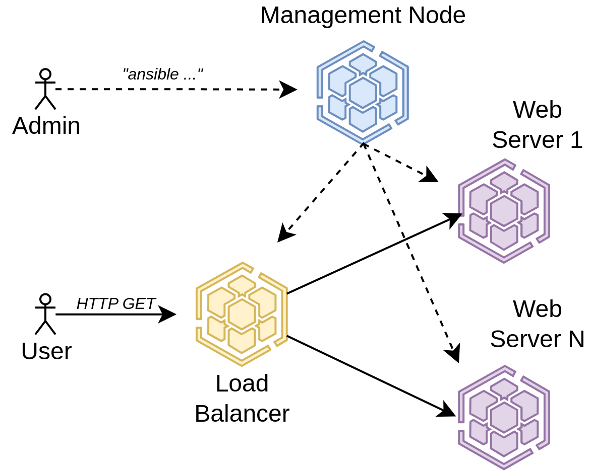

<a href="https://dei.tecnico.ulisboa.pt/"></a>

# Lab 2 - Infrastructure as Code (IaC)

The objective of this lab is to introduce a simple IT Automation Engine that is used to expedite many IT operations, such as Cloud Provisioning, Configuration Management, Application Deployment, Intra-service Orchestration, etc. The IT Automation Engine to use is named **Ansible** and it models an IT Infrastructure by describing how all systems interrelate.


**Ansible** is “agentless”, meaning that it uses no agents in the infrastructure nodes, making it easy to deploy – and most importantly, it uses a very simple language called **YAML** (Yet Another Markup Language), in the form of Ansible Playbooks. These are special text files in plain English describing the automation jobs.


Ansible works by establishing connections to the Infrastructure Nodes and pushing out small programs, called Ansible Modules, to them. These programs are written to be resource models of the **desired state** of the system. Ansible executes those modules (over SSH by default), and automatically removes them when finished. Ansible is typically installed on a “management machine” that is operated directly by operations team.


**Docker** will also be used to create the virtual environment (see the following figure), including one container with Ansible on it to act as the Management Node. Several additional Docker containers will be created, as Infrastructure nodes to be managed by Ansible.


Using these tools, we will deploy the following infrastructure:

{width=500}

## Part 1: Setting up the Local Infrastructure

Let's get to it! First step is to launch all the containers we need before we can use ansible to configure and launch applications. Can we use `ubuntu`? Does it have ansible already?

```
> docker run --rm -it ubuntu ansible
docker: Error response from daemon: failed to create task for container: failed to create shim task: OCI runtime create failed: runc create failed: unable to start container process: exec: "ansible": executable file not found in $PATH: unknown
```

Nope! We need to build a Docker image with it. Fortunately for you, we prepared a `Dockerfile` for this lab (you can thank us later). Have a look at the `Dockerfile` next to this `README.md`:

```
# Use the official Ubuntu base image
FROM ubuntu:latest

# Prevent interactive prompts during package installation
ENV DEBIAN_FRONTEND=noninteractive

# Update package lists and install ansible
RUN apt-get update && \
    apt install -y software-properties-common && \
    apt-add-repository -y -u ppa:ansible/ansible && \
    apt-get update && \
    apt-get install -y ansible

# Install facilities
RUN apt-get install -y supervisor openssh-server iputils-ping

# Create directories for supervisor and sshd
RUN mkdir -p /var/run/sshd /var/log/supervisor

# Copy supervisor config
COPY supervisord.conf /etc/supervisor/conf.d/supervisord.conf

# Clean cache packages
RUN apt-get clean all && \
    rm -rf /var/lib/apt/lists/*

# Set working directory
WORKDIR /root

# Supervisor is out "init". Launches ssh and waits forever.
CMD ["/usr/bin/supervisord"]
```

Nothing too surprising. We are installing Ansible, sshd (our ssh server), and iputils such that we can ping servers. We are also installing supervisor, which is actually used as the entrypoint command for our container. Whats up with that? Try to figure out by looking at the `supervisor.conf` file.

You know what to do now:

```
> docker build -t lab2-image .
[+] Building 0.1s (13/13) FINISHED                                                                                                                                            docker:default
 => [internal] load build definition from Dockerfile                                                                                                                                    0.0s
 => => transferring dockerfile: 999B                                                                                                                                                    0.0s
 => [internal] load metadata for docker.io/library/ubuntu:latest                                                                                                                        0.0s
 => [internal] load .dockerignore                                                                                                                                                       0.0s
 => => transferring context: 2B                                                                                                                                                         0.0s
 => [1/8] FROM docker.io/library/ubuntu:latest                                                                                                                                          0.0s
 => [internal] load build context                                                                                                                                                       0.0s
 => => transferring context: 104B                                                                                                                                                       0.0s
 => CACHED [2/8] RUN apt-get update &&     apt install -y software-properties-common &&     apt-add-repository -y -u ppa:ansible/ansible &&     apt-get update &&     apt-get install   0.0s
 => CACHED [3/8] RUN apt-get install -y supervisor openssh-server iputils-ping                                                                                                          0.0s
 => CACHED [4/8] RUN mkdir -p /var/run/sshd /var/log/supervisor                                                                                                                         0.0s
 => CACHED [5/8] COPY supervisord.conf /etc/supervisor/conf.d/supervisord.conf                                                                                                          0.0s
 => CACHED [6/8] RUN apt-get clean all &&     rm -rf /var/lib/apt/lists/*                                                                                                               0.0s
 => CACHED [7/8] ADD ssh-keys/id_rsa.pub /root/.ssh/authorized_keys                                                                                                                     0.0s
 => CACHED [8/8] WORKDIR /root                                                                                                                                                          0.0s
 => exporting to image                                                                                                                                                                  0.0s
 => => exporting layers                                                                                                                                                                 0.0s
 => => writing image sha256:17a864a5829178d8d13fb3cb1e313b6d4e75597d4ceea99ebc31c7b793c04575                                                                                            0.0s
 => => naming to docker.io/library/lab2-image
```

Let's see, Ansible?

```
> docker run --rm -it lab2-image ansible --version
ansible [core 2.18.6]
  config file = /etc/ansible/ansible.cfg
  configured module search path = ['/root/.ansible/plugins/modules', '/usr/share/ansible/plugins/modules']
  ansible python module location = /usr/lib/python3/dist-packages/ansible
  ansible collection location = /root/.ansible/collections:/usr/share/ansible/collections
  executable location = /usr/bin/ansible
  python version = 3.12.3 (main, Jun 18 2025, 17:59:45) [GCC 13.3.0] (/usr/bin/python3)
  jinja version = 3.1.2
  libyaml = True
```

Sweet! The next question is how do we launch multiple containers. We can obviously create one by one:

```
> docker run --rm --name lb   -d lab2-image
> docker run --rm --name web1 -d lab2-image
> docker run --rm --name web2 -d lab2-image
> docker run --rm --name mgmt -d lab2-image
```

We could, but there are more powerful mechanisms offered by Docker. Enter [Docker Compose](https://docs.docker.com/compose/), "a tool for defining and running multi-container applications". Docker Compose accepts a configuration file that describes the infrastructure that we want to manage. Let's analyze the `compose.yaml` file:

```
services:
  mgmt:
    build: .
    container_name: mgmt
    volumes:
    - type: bind
      source: .
      target: /root/lab2

  web1:
    build: .
    container_name: web1

  web2:
    build: .
    container_name: web2

  balancer:
    build: .
    container_name: balancer
    ports:
      - 8080:80
```

The compose file describes a number of services: `mgmt` (our management node), `web1` and `web2` (our web servers), and `balancer` (our load balancer). For each service, we are defining a `build` field which tells where is the `Dockerfile` that produces the image for that service (we point to the current directory where our `Dockerfile` exists). Finally, for the management node we want to mount our `lab2` directory into the container (more on that later).

Okay, let's start all of these services!

```
> docker compose up -d
[+] Running 4/5
 ⠇ Network lab2_default  Created
 ✔ Container mgmt        Started
 ✔ Container balancer    Started
 ✔ Container web2        Started
 ✔ Container web1        Started
```

Yeah! Try to connect to the management node and ping the other nodes:

```
> docker exec -it mgmt ping balancer -c 1
PING balancer (192.168.128.5) 56(84) bytes of data.
64 bytes from balancer.lab2_default (192.168.128.5): icmp_seq=1 ttl=64 time=0.040 ms

--- balancer ping statistics ---
1 packets transmitted, 1 received, 0% packet loss, time 0ms
rtt min/avg/max/mdev = 0.040/0.040/0.040/0.000 ms
```

Cool, we can reach the other containers from the management node!

```
> ping balancer -c 1
ping: balancer: Name or service not known
```

Hmm.

```
> ping 192.168.128.5 -c 1
PING 192.168.128.5 (192.168.128.5) 56(84) bytes of data.
64 bytes from 192.168.128.5: icmp_seq=1 ttl=64 time=0.057 ms

--- 192.168.128.5 ping statistics ---
1 packets transmitted, 1 received, 0% packet loss, time 0ms
rtt min/avg/max/mdev = 0.057/0.057/0.057/0.000 ms
```

Hmmmm. Why can't we ping using the name of the container from the host? Tip: look for how name resolution works inside a container network.

**Note:** If you are a Mac user, you may need a workaround for [accessing the containers directly using their IPs](https://docs.docker.com/desktop/features/networking/#known-limitations:~:text=ssh%2Dauth.sock-,Known%20limitations,-Changing%20internal%20IP), as the Docker Engine runs inside a VM (on macOS and Windows) and containers run within their private network. For this, you can use [docker-mac-net-connect](https://github.com/chipmk/docker-mac-net-connect) by installing it with `brew install chipmk/tap/docker-mac-net-connect` and then running `sudo brew services start chipmk/tap/docker-mac-net-connect`. At the end of the lab, run `sudo brew services stop chipmk/tap/docker-mac-net-connect` to stop the service.


**Note 2:** If you are a Windows user, skip this step as you won't be able to reach the container from the host network.

So far we managed to launch our infrastructure composed of 4 Docker containers and we know how to connect to them. We also know that they can connect to each other. For convinience, we prepared a `justfile` so that you don't have to remember all commands by heart. Using it is quite simple:

```
> just start # This will launch docker compose.
> just mgmt  # Connects to the management node.
> just stop  # You guess it...
```

If you don't have `just` installed, follow the instructions on their [github page](https://github.com/casey/just).

# Part 2: Using Ansible in our local infrastructure

Alright, let's get to business with Ansible. We know that Ansible uses ssh to connect to other nodes. And we also remember that we installed an ssh server in our Docker image. So, in theory, it should work, right? Right?

```
> just mgmt
root@40dd36b5adcc:~ > cd lab2/ansible
root@40dd36b5adcc:~/lab2/ansible > ansible web1 -m ping
[WARNING]: Unable to parse /root/lab2/ansible/inventory.ini as an inventory source
[WARNING]: No inventory was parsed, only implicit localhost is available
[WARNING]: provided hosts list is empty, only localhost is available. Note that the implicit localhost does not match 'all'
[WARNING]: Could not match supplied host pattern, ignoring: web1
```

Okay, the first obstacle is that Ansible wants an inventory file with the IPs of all nodes managed by Ansible. In our case, this would suffice:

```
balancer ansible_host=<balancer IP> ansible_user=root ansible_connection=ssh
web1 ansible_host=<web1 IP> ansible_user=root ansible_connection=ssh
web1 ansible_host=<web2 IP> ansible_user=root ansible_connection=ssh
```

Easy, we just need to collect IPs for all containers and organized them in a file. The interesting challenge is to do it completely automatically. Fortunately, Docker allows us to query information about each container. Check the `justfile` and analyze the `inventory` target. Run it and then analyze the result as well. After running the `inventory` target in the host, let's try again checking:

```
> just mgmt
root@40dd36b5adcc:~ > cd lab2/ansible
root@40dd36b5adcc:~ > ansible web1 -m ping
web1 | UNREACHABLE! => {
    "changed": false,
    "msg": "Failed to connect to the host via ssh: Warning: Permanently added '192.168.144.3' (ED25519) to the list of known hosts.\r\nno such identity: /root/.ssh/id_rsa: No such file or directory\r\nroot@192.168.144.3: Permission denied (publickey,password).",
    "unreachable": true
}
```
Ouhh, Ansible cannot connect to the remote node... When using an Automation Engine such as Ansible, the connectivity to remote machines from the Management Node is done via ssh (Secure Shell). One issue that we need to deal with is that, if the management node has not yet connected to a machine via SSH, you will be prompted to verify the ssh authenticity of the remote node. Even after that, the management node needs to have a password-less authentication mechanism (using cryptographic keys) to access the remote node.

# Part 3: Ensuring SSH Connectivity Between Nodes

Ansible is complaining that it can't connect through ssh. That should be easy to fix, we need three bits:
    1 - generate an ssh key pair (public and private);
    2 - the public and private keys should be installed in the management node.
    3 - the public key should be distributed in all other nodes and have its access authorized;

First step, we need to create an SSH key pair. Fortunately, there is an easy command for that:

```
> mkdir ssh-keys
> ssh-keygen -N "" -f ssh-keys/id_rsa -t rsa -b 2048
Generating public/private rsa key pair.
Your identification has been saved in ssh-keys/id_rsa
Your public key has been saved in ssh-keys/id_rsa.pub
The key fingerprint is:
SHA256:48OoM1IXCEfy7zjGrxb9Pgk+oT/booq/Bh9Pe6xIle8 rbruno@callisto
The key's randomart image is:
+---[RSA 2048]----+
|  ...            |
|  .o.            |
|   o..           |
|    .o.          |
|    o...S        |
|. .o++=+ .       |
| o.==B+++.       |
| o+oB=B.+.       |
|.o===OE*o.       |
+----[SHA256]-----+
> ls ssh-keys/
id_rsa  id_rsa.pub

```

The first command just creates a directory where your keys will be placed. The second, creates an SSH key pair: a public and a private one.

Second step, we need to disseminate the public key so that all of our containers know it and accept SSH connections starting from someone that owns the private key. There are many ways to do it but today we are going to copy the key into the Docker image. Just add the following line in your `Dockerfile` (insert after intalling all packages):

```
ADD ssh-keys/id_rsa.pub /root/.ssh/authorized_keys
```

Rebuild the Docker image and any new container started using the new image will have it. Third step, we need to make sure that our management node (`mgmt`) also has the private key so that it can connect to the other nodes. Again, there are multiple ways of doing it, for example, we could have another Docker image that contains both the public and private keys. However, to make it simple, we are going to mount the key pair directly into the management container. Check the new `bind` entry in the `compose.yaml` file :

```
  mgmt:
    build: .
    container_name: mgmt
    volumes:
    - type: bind
      source: .
      target: /root/lab2
    - type: bind
      source: ssh-keys
      target: /root/.ssh
```

That should do it! Let's test Ansible again:

```
> just start
(skipped ...)
> just mtmt
> cd lab2/ansible/
> ansible web1 -m ping
web1 | SUCCESS => {
    "ansible_facts": {
        "discovered_interpreter_python": "/usr/bin/python3.12"
    },
    "changed": false,
    "ping": "pong"
}
```

Sweet, Ansible can interact with the other nodes. Check that you can also ssh into `web1` but not the other way around.

Run some ad-hoc Ansible commands, targeting all nodes:

1. Start with the ping module to verify that all nodes are up

```
ansible all -m ping
web1 | SUCCESS => {
    "ansible_facts": {
        "discovered_interpreter_python": "/usr/bin/python3.12"
    },
    "changed": false,
    "ping": "pong"
}
balancer | SUCCESS => {
    "ansible_facts": {
        "discovered_interpreter_python": "/usr/bin/python3.12"
    },
    "changed": false,
    "ping": "pong"
}
web2 | SUCCESS => {
    "ansible_facts": {
        "discovered_interpreter_python": "/usr/bin/python3.12"
    },
    "changed": false,
    "ping": "pong"
}
```

2. Check the uptime of your hosts with

```
>ansible all -m shell -a "uptime"
balancer | CHANGED | rc=0 >>
 13:54:02 up 8 days, 18:00,  0 user,  load average: 0.69, 0.71, 0.78
web1 | CHANGED | rc=0 >>
 13:54:02 up 8 days, 18:00,  0 user,  load average: 0.69, 0.71, 0.78
web2 | CHANGED | rc=0 >>
 13:54:02 up 8 days, 18:00,  0 user,  load average: 0.69, 0.71, 0.78
```

3. Check what kernel versions are running on the hosts with

```
> ansible all -m shell -a "uname -a"
web1 | CHANGED | rc=0 >>
Linux 86b314430b16 6.1.0-16-amd64 #1 SMP PREEMPT_DYNAMIC Debian 6.1.67-1 (2023-12-12) x86_64 x86_64 x86_64 GNU/Linux
balancer | CHANGED | rc=0 >>
Linux 5bf068b99fe9 6.1.0-16-amd64 #1 SMP PREEMPT_DYNAMIC Debian 6.1.67-1 (2023-12-12) x86_64 x86_64 x86_64 GNU/Linux
web2 | CHANGED | rc=0 >>
Linux 48ab8b088a5b 6.1.0-16-amd64 #1 SMP PREEMPT_DYNAMIC Debian 6.1.67-1 (2023-12-12) x86_64 x86_64 x86_64 GNU/Linux
```

Many of the steps that we covered so far can be automated! Check `justfile` to find that everything we've done so far can be done with a simple command.

# Part 4: Setting Up a Load Balanced Web Service

The end result of this lab experiment will be a local infrastructure environment with a fully functional Load Balancer (implemented with [haproxy](http://www.haproxy.org)), with multiple web servers sitting behind it (implemented with [nginx](https://www.nginx.com)).

You will use Ansible to install packages, deploy configuration files, and start the correct services to each of these servers, all without logging in manually into any of those servers.

### Quick Note on Ansible Playbooks

Playbooks are Ansible’s configuration, deployment, and orchestration language. The file is formatted in **YAML** (YAML Ain't Markup Language, a recursive acronym), human-readable and very easy to understand. You can learn about Playbooks in more detail at the [Ansible documentation site](https://docs.ansible.com/ansible/latest/playbook_guide/playbooks_intro.html).

A Playbook is composed of one or more “**plays**” in a list. Looking at a playbook file you will find the following structure:

* **hosts**: This “play” defines which hosts in the **hosts inventory** we want to target. For this “play” the hosts will be **“all”**
    * **remote user**: The name of the user.
    * **become**: We want to run these commands as super user.
    * **become method**: The method is sudo.
    * **gather facts**: By default, “facts” are gathered when a Playbook is run against remote hosts. These facts include things such as hostname, network addresses, etc. These facts can be used to alter the Playbook execution behavior, or to be included in configuration files. We are not going to use them just yet, so “facts” are turned off.

* **tasks**: This section of the hosts play, is where we define the tasks we want to run against the remote machines. Tasks use different modules that have different sub-fields.

### Deploying a Load Balancer Web Service

Before deploying, you should start by analyzing the **deploy.yml** playbook. You will notice that it consists of three plays that will allow to target specific groups of nodes, from within the same Playbook:

1. The first play (**# common**) targets **all nodes** declared in the **hosts inventory**. This is useful for laying down a common configuration across a fleet of machines;
2. The **# web** play targets **all the web** nodes, for installing the web server, tweaking configuration files, and starting services;
3. The **# balancer** play addresses the **load balancer** node, and you will notice a peculiar method in the tasks that basically allows to iterate over a list of packages, and have them installed, without duplicating code blocks.


You will likely understand the majority of what each play is doing, as it is just installing the package(s), deploying configuration file(s) and service patterns, some using [Jinja2](https://palletsprojects.com/p/jinja/), a template engine for Python, making sure that things are effectively started.

To get acquainted with these templates and the way to use the “variables” known by Ansible, you can now observe the “Ansible Facts”. In Ansible, variables related to remote systems are called facts, while variables related to Ansible itself are called "magic variables".

Facts that are related to remote systems include operating systems, IP addresses, attached file systems, etc.

Try the following to discover some of those facts related to the servers just configured, for example the balancer:


```
root@40dd36b5adcc:~ > ansible balancer -m setup
balancer | SUCCESS => {
 "ansible_facts": {
 "ansible_apparmor": {
 "status": "disabled"
 },
 ......
```

For our purpose, i.e., identifying correctly the adequate "**facts**" (i.e., the variables) that we need to have configured in the templates for automatic configuration (Jinja2), we need to know how to determine from the Dictionary the elements that will provide us with the IP address and the hostname of each host. For that purpose, let us "inspect" what Ansible returns.

The following command asks Ansible to obtain the `ansible_host` IP, from all "targets" defined in the inventory. Compare the used variables with the Facts you obtained earlier with `ansible balancer -m setup`:

```
> ansible -i inventory.ini -m debug -a "var=hostvars[inventory_hostname].ansible_host" all
balancer | SUCCESS => {
 "hostvars[inventory_hostname].ansible_host": "192.168.56.11"
}
web1 | SUCCESS => {
 "hostvars[inventory_hostname].ansible_host": "192.168.56.31"
}
web2 | SUCCESS => {
 "hostvars[inventory_hostname].ansible_host": "192.168.56.32"
}
```

#### The Load Balancer (haproxy)

The [HAProxy](http://www.haproxy.org/) (community Edition) is a Free, very fast, Reliable, High Performance TCP/HTTP Load Balancer solution, particularly suited for very high traffic web sites.

The HAProxy configuration file (**haproxy.cfg**) guides the behavior of the load balancer. In this case, you may observe that you have several files with the extension j2 in the **frontend_templates** folder. These files are **Jinja2** template files for configurations of the services to be installed, and one of them corresponds to the **haproxy.cfg**.

There are four essential sections in the **haproxy.cfg** configuration file. They are global, defaults, frontend, and backend. These four sections define how the server performs as a whole, which are the default settings, and how client requests are received and routed to the backend web servers.

You can also observe in the file that some parameters are placed inside double curly braces {{.....}}, which correspond to variables that will be “replaced” with specific values by Ansible when configuring each server (try to understand which task is responsible for this).


#### Web Servers (nginx)

From their website, [NGINX](https://www.nginx.com/resources/glossary/nginx/) is an open source software for web serving, reverse proxying, caching, load balancing, media streaming, and more. It started out as a web server designed for maximum performance and stability. In addition to its HTTP server capabilities, NGINX can also function as a proxy server for email (IMAP, POP3, and SMTP) and as reverse proxy and load balancer for HTTP, TCP, and UDP servers.

The choice for using NGINX for this Lab experiment was just to prove that is possible to mix in the same solution different applications with identical functionalities, such as the cases of HAProxy and NGINX, as both can also be configured as High Performance Load Balancers.

In our case, one is configured just as a Load Balancer and the other just as a Web Server.

#### Deployment Procedures

We are going to use Ansible to configure the web servers and he load balancer. Read through the `deploy.yaml` and analyze how the configuration templates will be used (`.j2` files). Then, hop into the management node and run the Ansible playbook:

```
> just mgmt
root@40dd36b5adcc:~ > cd lab2/ansible/
root@40dd36b5adcc: > ansible-playbook deploy.yaml
(skipped ...)
PLAY RECAP **********************************************************************************************************************************************************************************
balancer                   : ok=8    changed=6    unreachable=0    failed=0    skipped=0    rescued=0    ignored=0
web1                       : ok=9    changed=7    unreachable=0    failed=0    skipped=0    rescued=0    ignored=0
web2                       : ok=9    changed=7    unreachable=0    failed=0    skipped=0    rescued=0    ignored=0
```

If there are no errors, then we should be good to go. Using the following URL http://localhost:8080 (which maps to your load balancer, as configured in `compose.yaml`), you should get something like the following:

```
AGISIT LAB2 \o/

13e70417b4f6
  ------------------------
                   \   ^__^
                          \  (**)\_______
                             (__)\       )\/\
                              U  ||----w |
                                 ||     ||


```

Try to figure out what are the strange characters.

Hit the refresh button on the web browser (forcing with the Shift key). **Did something change?** If so, repeat the refresh several times. Pay attention to the results you have observed each time you refreshed the page.

Open a second tab in your browser and navigate to http:///localhost:8080/haproxy?stats. You should land on the Load Balancer statistics page. For reference, read “[Exploring the HAProxy Stats Page](https://www.haproxy.com/blog/exploring-the-haproxy-stats-page/)”.

Try to modify the web page to include additional information about the underlying system such as the uptime, number of processes, and available memory in the system;

Finally, for convinience, the `justfile` will also help you deploy it directly from your shell. In summary, you can quickly start, deploy, stop, and clean the entire infrastructure:

```
> just start   # Starts containers
> just deploy  # Deploys web servers and balancer
> # Wait until you want to shutdown...
> just stop    # Destroyes containers
> just clean   # Removes temporary files
```

Cool, right?

# Part 5: Benchmarking the Infrastructure

For the last experiments is this Lab, we need to use a benchmark command-line tool, which is a load generator for testing websites and HTTP APIs, commonly known as [Apache Benchmark](https://httpd.apache.org/docs/2.4/programs/ab.html).

You will use the tool, from your personal computer or from the management node.

* Note: **ApacheBench** is already included with the Apple macOS distribution and no configuration or installation is necessary.

* For **Linux and WSL** distributions, you should proceed as follows to install the tool:

```shell
> sudo apt-get update
> sudo apt-get -y install apache2-utils
```

The command line call for ApacheBench in both macOS or Linux is simply **ab** with parameters, for example:

```
> ab -n 1000 -c 2 http://localhost:8080
```

Interpret the output. Change the number of concurrent requests and see how it affects the results.
